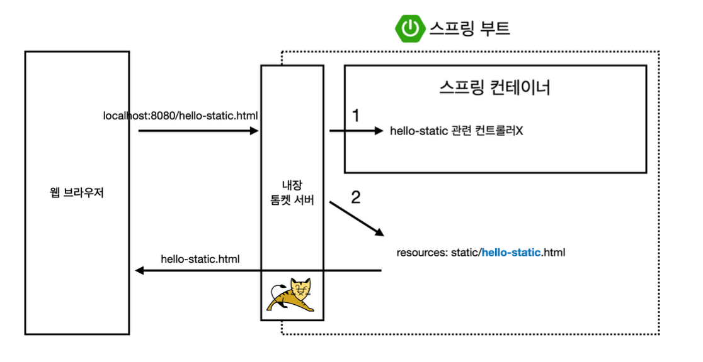
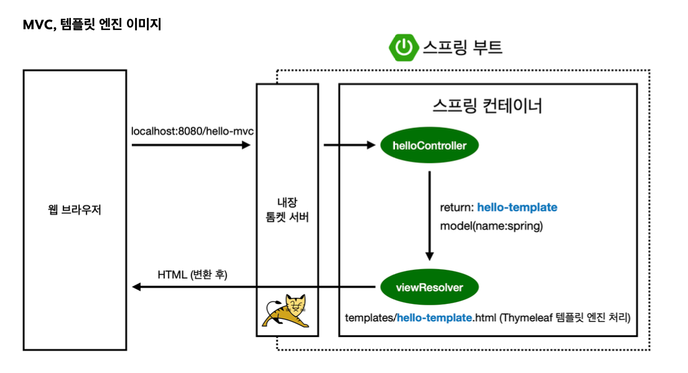
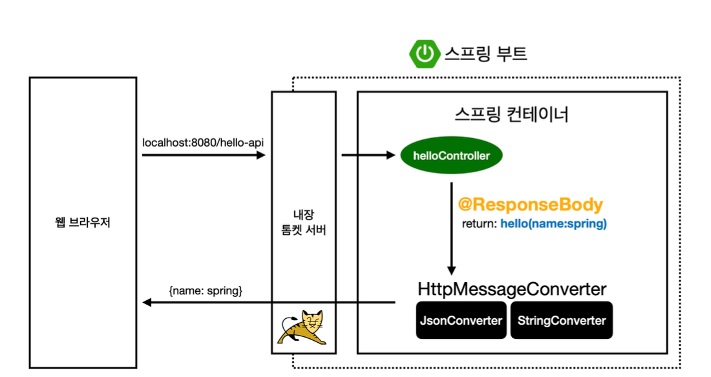
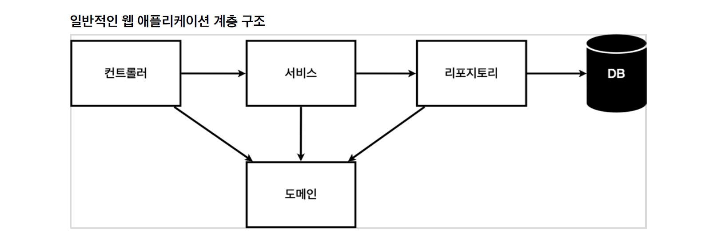

# 1주차 


## 웹 개발 방식

1. `정적 컨텐츠` : 파일 자체를 웹 브라우저에 전달
2. `MVC와 템플릿 엔진` : server에서 html파일을 변환 후 전달
3. `API` : xml이나 JSON(default)으로 client에게 전달, server끼리 통신할 때 사용


## 정적 컨텐츠

정적 컨텐츠란 단순하게 html파일을 브라우저 요청에 대해 응답해주는 것이다. 사실 정적 컨텐츠 방식을 안쓰기 위해 웹 프레임워크가 등장한거다.



static/ 에 hello-static.html 파일을 만들고 대충 html을 작성하면 다음과 같은 방식으로 웹 브라우저는 hello-static.html을 응답받는다.

웹 브라우저는 baseUrl/hello-static.html 로 요청을 보내고 내장 톰켓 서버는 이를 받아 스프링에 준다.

 스프링은 hello-static 관련 컨트롤러가 없음을 확인하고 resources 쪽에서 static/hello-static.html을 브라우저에 준다.

 ## MVC와 템플릿 엔진 

main/java/hello/hello_spring/ 경로에 controller 디렉토리를 만든다. 그 안에 HelloController 자바 클래스를 만든다.

```java
@GetMapping("hello-mvc")
    public String helloMvc(@RequestParam("name") String name, Model model) {
        model.addAttribute("name", name);
        return "hello-template";
}
```

GetMapping으로 BaseUrl/hello-mvc url 매핑이 가능하며, helloMvc메서드는 url의 param에서 name을 받아 스프링이 던져준 Model model에 이를 key-value형식으로 담고 "hello-template"을 리턴한다.

이때 "hello-template"은 templates폴더에 존재하는 html파일 이름이며 이 html에서는 템플릿 엔진(thymeleaf)을 사용하여 컨트롤러에서 넘어온 name을 활용할 수 있다.


```html
<html xmlns:th="http://www.thymeleaf.org">
<body>
<p th:text="'hello ' + ${name}">hello! empty</p>
</body>
</html>
```

p태그의 th로 보이는 것이 우리가 의존성으로 설치한 thymeleaf를 활용하는 것이다. 이렇게 url을 통해 다음과 같이 url로 요청을 보낸다면, BaseUrl/hello-mvc?name=inyoung Controller의 name에 inyoung이 배치되고 "name": inyoung로 템플릿으로 보내게 되는 것이다.




## API
현재 가장 많이 쓰이는 순수하게 데이터만 보내는 역할이다. MVC의 경우 스프링부트 개발자는 Template의 연결, 즉 프론트엔드까지 고려해야 했으나 API는 단순하게 json형식으로 요청받은 데이터만 보내준다.

```java
@GetMapping("hello-api")
    @ResponseBody
    public Hello helloApi(@RequestParam("name") String name) {
        Hello hello = new Hello();
        hello.setAge(15);
        hello.setName(name);
        hello.setNext(new Hello());
        hello.getNext().setName(name);
        hello.getNext().setAge(16);

        return hello;
    }

    static class Hello {
        private String name;
        private int age;
        private Hello next;

        public String getName() {
            return name;
        }

        public void setName(String name) {
            this.name = name;
        }

        public int getAge() {
            return age;
        }

        public void setAge(int age) {
            this.age = age;
        }

        public Hello getNext() {
            return next;
        }

        public void setNext(Hello next) {
            this.next = next;
        }
    }

```

쓸데 없이 복잡하게 구상해보았다. 바뀐 것은 @ResponseBody가 추가되었다는 것과 return 형식이 string이 아닌 커스텀 클래스 타입이라는 것이다. 
이 경우도 스프링은 알아서 viewResolver가 아닌 다른 것을 활용한다.



객체로 return할 경우 JsonConverter가 작동한다. 현재 위의 객체의 구조는 내부 속성으로 String name, age int와 같은 객체를 또 담고 있다.

url에 http://localhost:8080/hello-api?name=inyoung 위와 같이 접속할 경우 name이 inyoung으로 전달될 것이고 이것은 객체 내부의 name에 저장된다. 객체는 다음과 같이 json화 해서 펼쳐진다.


# 백엔드 개발

1. 비즈니스 요구사항 정리
2. 회원 도메인과 리포지토리 만들기
3. 회원 리포지토리 테스트 케이스 작성
4. 회원 서비스 개발
5. 회원 서비스 테스트

(김영한 강사님의 <스프링 입문>을 수강하며 회원 도메인과 리포지토리를 만들고 서비스를 개발해 테스트하기까지의 예제 프로젝트를 다룬 내용입니다.)

## 1. 비즈니스 요구사항 정리


데이터: 회원ID, 이름
기능: 회원 등록, 조회
아직 데이터 저장소가 선정되지 않음(가상의 시나리오)


해당 예제의 계층 구조는 다음과 같다.




- 컨트롤러 : 웹 MVC의 컨트롤러 역할
- 서비스 : 핵심 비즈니스 로직 구현
- 리포지토리 : 데이터베이스에 접근, 도메인 객체를 DB에 저장하고 관리
- 도메인 : 비즈니스 도메인 객체
(ex. 회원, 주쿤, 쿠폰 등등 주로 데이터 베이스에 저장하고 관리됨)

해당 예제의 클래스 의존 관계는 다음과 같다.
(실선: 클래스 상속, 점선: 인터페이스 상속)

- 아직 데이터 저장소가 선정되지 않아서, 우선 인터페이스로 구현 클래스를 변경할 수 있도록 설계
- 데이터 저장소는 RDB, NoSQL 등등 다양한 저장소를 고민중인 상황으로 가정
- 개발을 진행하기 위해서 초기 개발 단계에서는 구현체로 가벼운 메모리 기반의 데이터 저장소 사용

## 2. 회원 도메인과 리포지토리 만들기

### ▶ 2.1 회원 객체
src/main/java 폴더에 Member클래스를 생성했다.

```java
package hello.hellospring.domain;

public class Member {

    private Long id;
    private String name;

    public Long getId() {
        return id;
    }

    public void setId(Long id) {
        this.id = id;
    }

    public String getName() {
        return name;
    }

    public void setName(String name) {
        this.name = name;
    }
}
```

요구사항대로 회원ID, 이름을 받는 id와 name 변수를 작성했다.


- 데이터 타입은 wrapper클래스 Long형
그 이유는 기본형인 long을 사용하면 객체를 생성하는 시점에 id값에 0이라는 기본값이 들어가는 반면, Long을 사용하면 기본값이 null이기 때문에 값이 없다는 것을 잘 표현할 수 있기 때문이다.

✔ (wrapper class: 기본 자료타입(primitive type)을 객체로 다루기 위해서 사용하는 클래스들)

- getter와 setter
메서드는 외부에서의 직접적인 접근을 막아 데이터를 보호하기 위해 사용된다. getter(획득자)는 인스턴스 변수를 반환하고, setter(설정자)는 인스턴스 변수를 할당한다. 외부에서는 get과 set 메서드로 접근한다.


## ▶ 2.2 회원 인터페이스
src/main/java 폴더에 회원 인터페이스 MemberRepository를 생성했다.

```java
package hello.hellospring.repository;
import hello.hellospring.domain.Member;

import java.util.List;
import java.util.Optional;

public interface MemberRepository {
    void save(Member member);
    Optional<Member> findById(Long id);
    Optional<Member> findByName(String name);
    List<Member> findAll();

}
```

- Optiona`<T>`
Java8에서는 Optional`<T>` 클래스를 사용해 NPE(NullPointerException)를 방지할 수 있도록 도와준다. Optional`<T>`는 null이 올 수 있는 값을 감싸는 Wrapper 클래스로, 참조하더라도 NPE가 발생하지 않도록 도와준다.

예를들어, 다음과 같은 코드에서 findByName()을 호출하는데, Repository(DB)에 인자로 넘긴 이름(홍길동)의 회원 객체가 없을 경우(NULL) NPE가 발생한다.

```java
Member member1 = memberRepository.findByName("홍길동");
member1.getAge(); <<-- NPE 발생
이러한 문제를 해결하기 위해 반환타입을 옵셔널을 적용하여 사용한다.
```

- <b>findBy</b>

findBy뒤에 컬럼명을 붙여주면 이를 이용한 검색이 가능하다.


- <b>findAll</b>

SELECT*ALL과 같다. 모든 튜플을 가져온다.


- <b>List<T></b> 

리스트 컬렉션. 리스트는 배열과 동일한 역할을 하며 크기를 지정할 필요가 없고, 제공하는 메서드를 사용할 수 있다. 객체이기 때문에 new 연산자를 사용해야 한다.


## ▶ 2.3 회원 리포지토리 메모리 구현체
src/main/java 폴더에 회원 리포지토리 메모리 MemoryMemberRepository를 생성하고, 앞서 만든 MemberRepository 인터페이스를 구현한다.(implements)

```java
package hello.hellospring.repository;

import hello.hellospring.domain.Member;

import java.util.*;

public class MemoryMemberRepository implements MemberRepository {
    private static Map<Long, Member> store = new HashMap<>();
    private static long sequence = 0L;

    @Override
    public void save(Member member) {
        member.setId(++sequence);
        store.put(member.getId(), member);
    }
    @Override
    public Optional<Member> findById(Long id) {
        return Optional.ofNullable(store.get(id));
    }
    @Override
    public List<Member> findAll() {
        return new ArrayList<>(store.values());
    }
    @Override
    public Optional<Member> findByName(String name) {
        return store.values().stream()
                .filter(member -> member.getName().equals(name))
                .findAny();
    }
    public void clearStore() {
        store.clear();
    }
}
``` 
<b>- Map<K, V></b>

Map은 키-값 쌍으로 구성된 데이터를 저장할 수 있는 interface형식이다.
그렇기에 아래와같이 직접적으로 생성이 불가능하며

```java
[불가능] Map<String,String> cc = new Map<String,String>();
[가능]  Map<String,String> bb = new HashMap<String,String>();
```

Map인터페이스의 구현체로 HashMap등의 클래스를 사용해야 한다. 실무에서 많이들 사용하는 HahMap은 키와 값형태로 데이터를 저장가능하게 해준다.

```java
HashMap<String,String> aa = new HashMap<String,String>();
aa.put("aa","value1");
aa.put("bb","value2");
```

얻는 이점은 위처럼 함수를 요청할 때 HashMap,TreeMap등으로 접근이 가능하게 해주기에 코드의 유연함과 Map의구현체만 접근이 가능하게 된다. JAVA언어의 객체지향특징중 다형성에 해당되는 원리이다.


- <b>private static long sequence = 0L;</b>

sequnece는 0, 1, 2, ... 키값을 생성해준다.


- stream().filter().findAny();

스트림은 배열이나 컬렉션(List, Set, Map)으로 원하는 값을 얻을 때 for문 도배를 방지하기 위해 나온 개념이다. 메소드를 연달아 쓰면 메소드에 맞게 값이 정리되어 나온다.

```java
.filter(): 조건에 맞는 원소 추출.
.findAny():  해당 스트림에서 첫 번째 요소를 참조하는 Optional 객체를 반환. 
            두 메소드 모두 비어 있는 스트림에서는 비어있는 Optional 객체를 반환.
파라미터로 람다식이 올 수 있다. (타입 매개변수) -> { 실행문; ... }
```


3. 회원 리포지토리 테스트케이스 작성

개발한 기능을 실행해서 테스트 할 때 자바의 main 메서드를 통해서 실행하거나, 웹 애플리케이션의 컨트롤러를 통해서 해당 기능을 실행한다. 이러한 방법은 준비하고 실행하는데 오래 걸리고, 반복 실행하기 어렵고 여러 테스트를 한번에 실행하기 어렵다는 단점이 있다. 자바는 JUnit이라는 프레임워크로 테스트를 실행해서 이러한 문제를 해결한다.

src/test/java 하위 폴더에 생성한다.

```java
package hello.hellospring.repository;

import hello.hellospring.domain.Member;
import org.junit.jupiter.api.AfterEach;
import org.junit.jupiter.api.Assertions;
import org.junit.jupiter.api.Test;
import java.util.List;
import static org.assertj.core.api.Assertions.assertThat;
import static org.junit.jupiter.api.Assertions.*;

public class MemoryMemberRepositoryTest {

    MemoryMemberRepository repository = new MemoryMemberRepository();

    @AfterEach
    public void afterEach() {
        repository.clearStore();
    }

    @Test
    public void save() {
        Member member = new Member();
        member.setName("Spring");

        repository.save(member);

        Member result = repository.findById(member.getId()).get();
        assertThat(member).isEqualTo(result);

    }

    @Test
    public void findByName() {
//given
        Member member1 = new Member();
        member1.setName("spring1");
        repository.save(member1);
        Member member2 = new Member();
        member2.setName("spring2");
        repository.save(member2);
//when
        Member result = repository.findByName("spring1").get();
//then
        assertThat(result).isEqualTo(member1);
    }

    @Test
    public void findAll() {
//given
        Member member1 = new Member();
        member1.setName("spring1");
        repository.save(member1);
        Member member2 = new Member();
        member2.setName("spring2");
        repository.save(member2);
//when
        List<Member> result = repository.findAll();
//then
        assertThat(result.size()).isEqualTo(2);
    }
}
```
- MemberRepository repository = new MemoryMemberRepository();

repository를 인터페이스로 설계 할 경우, MemberRepository 인터페이스를 구현한 구현체의 변경이 용이해진다.


- Junit

자바용 단위 테스 도구이다. 테스트의 성공 여부를 알기 위해 Assertion메서드를 사용한다.

```js
assertEquals(a, b);  - 객체 A와 B가 일치함을 확인한다.
```

- assertThat

```
- juint의 assertThat
assertThat(T actual, Matcher<? super T> matcher);
assertThat(result, allOf(greaterThan(0), lessThan(10)));
actual: 검증 대상, matcher : 로직

- assertj의 assertThat
assertThat(T actual)
assertThat(result).isGreaterThan(0).isLessThan(10);
```
assertj의 assertThat은 인자로 actual(검증대상)만 받는다. 각 타입에 맞는 Assertino 메소드를 제공한다.asertj의 assertThat이 juint의 assertThat보다 가지는 장점은 크게 3가지가 있다.

1. 자동완성
2. Assertion 분류
3. 확장성

AssertJ의 메소드들은 이곳에 잘 정리되어있어 링크로 첨부했다.


- clear();

테스트 순서는 보장이 안된다. 모든 테스트는 메서드별로 따로 동작하게 설게되어야 한다.


findAll()이 먼저 테스트 되면서 'spring1', 'spring2'가 저장되었다. 그래서 findName()에서 오류가 발생한 것이다.

이것을 해결하려면 테스트가 하나 끝나면 데이터가 깔끔하게 삭제되게 해주어야 한다.
그래서 MomoryMemberRepository에 다음과 같은 코드를 작성해준 것이다.

public void clearStore() {
        store.clear();
    }
이후 MemoryMemberRepository에서 @AfterEach 어노테이션을 추가해 테스트 메서드가 끝날 때마다 저장소의 데이터를 깔끔하게 삭제해주는 코드를 작성한다.

@AfterEach
    public void afterEach() {
        repository.clearStore();
    }
테스트 순서에 관계없이 테스트가 잘 실행되는 것을 확인할 수 있다.


- clear();

테스트 순서는 보장이 안된다. 모든 테스트는 메서드별로 따로 동작하게 설게되어야 한다.


findAll()이 먼저 테스트 되면서 'spring1', 'spring2'가 저장되었다. 그래서 findName()에서 오류가 발생한 것이다.

이것을 해결하려면 테스트가 하나 끝나면 데이터가 깔끔하게 삭제되게 해주어야 한다.
그래서 MomoryMemberRepository에 다음과 같은 코드를 작성해준 것이다.


```java
public void clearStore() {
        store.clear();
    }
이후 MemoryMemberRepository에서 @AfterEach 어노테이션을 추가해 테스트 메서드가 끝날 때마다 저장소의 데이터를 깔끔하게 삭제해주는 코드를 작성한다.

@AfterEach
    public void afterEach() {
        repository.clearStore();
    }
```

테스트 순서에 관계없이 테스트가 잘 실행되는 것을 확인할 수 있다.


## 4. 회원 서비스 개발
src/main/java 하위폴더에 MemberService를 생성했다.
핵심 비즈니스 로직을 여기에 구현한다.

```java
package hello.hellospring.service;

import hello.hellospring.domain.Member;
import hello.hellospring.repository.MemberRepository;

import java.util.List;
import java.util.Optional;

public class MemberService {

    private  final MemberRepository memberRepository;

    public MemberService(MemberRepository memberRepository) {
        this.memberRepository = memberRepository;

    }

    /**
     * * 회원 가입
     */
    public Long join(Member member) {

        validateDuplicateMember(member); // 중복회원 검증
        memberRepository.save(member);
        return member.getId();
    }

    private void validateDuplicateMember(Member member) {
        memberRepository.findByName(member.getName())
                .ifPresent(m -> {
                    throw new IllegalStateException("이미 존재하는 회원입니다.");
                 });
    }

    public List<Member> findMembers() {
        return memberRepository.findAll();
    }

    public  Optional<Member> findOne(Long memberId) {
        return memberRepository.findById(memberId);
    }
}

```
서비스 클래스는 join, findMember 등 비즈니스 서비스 관련 단어를 사용해야 한다.
중복 회원이 있는지 검증하고, 있으면 '이미 존재하는 회원입니다.'로 예외처리하는 비즈니스 로직을 구현했다.


## 5. 회원 서비스 테스트
src/test/java 하위 폴더에 MemeberServiceTest를 생성했다.(단축키: ctrl+shift+T)

```java
package hello.hellospring.service;

import hello.hellospring.domain.Member;
import hello.hellospring.repository.MemoryMemberRepository;
import org.assertj.core.api.Assertions;
import org.junit.jupiter.api.AfterEach;
import org.junit.jupiter.api.BeforeEach;
import org.junit.jupiter.api.Test;

import java.util.Optional;

import static org.assertj.core.api.AssertionsForClassTypes.assertThat;
import static org.junit.jupiter.api.Assertions.*;

class MemberServiceTest {

    MemberService memberService;
    MemoryMemberRepository memberRepository;

    @BeforeEach
    public void beforeEach() {
        memberRepository = new MemoryMemberRepository();
        memberService = new MemberService(memberRepository);
    }

    @AfterEach
    public  void afterEach() {
        memberRepository.clearStore();

    }

    @Test
    void join() {
        //given
        Member member = new Member();
        member.setName("hello");
        //when

        Long saveId = memberService.join(member);

        //then
        Member findMember = memberService.findOne(saveId).get();
        Assertions.assertThat(member.getName()).isEqualTo(findMember.getName());
    }

    @Test
    public void  중복_회원_예외() {
        //given
        Member member1 = new Member();
        member1.setName("spring");

        Member member2 = new Member();
        member2.setName("spring");

        //when
        memberService.join(member1);
        IllegalStateException e = assertThrows(IllegalStateException.class, () -> memberService.join(member2));

        assertThat(e.getMessage()).isEqualTo("이미 존재하는 회원입니다.");
    }

/*        try {
            memberService.join(member2);
            fail();
        } catch (IllegalStateException e) {
            assertThat(e.getMessage()).isEqualTo("이미 존재하는 회원입니다.");
        }
        //then
    }*/

    @Test
    void findMembers() {
    }

    @Test
    void findOne() {
    }
}
```
회원가입, 중복 회원 예외 과정을 테스트해보았다.
오류 없이 정상적으로 동작한다.

테스트를 실행할 때, memberService에서 사용하는 리포지토리와 테스트에서 사용하는 레포지토리가 같아야한다.

memberService는 외부에서 new를 생성하도록 작성한다. 객체를 외부에서 생성하는 이것을 'DI(의존성 주입)'이라 한다.


memberServiceTest에서는 다음과 같이 코드를 작성해 테스트 실행 전마다 실행되게 한다.
(테스트는 독립적)

```java
    @BeforeEach
    public void beforeEach() {
        memberRepository = new MemoryMemberRepository();
        memberService = new MemberService(memberRepository);
    }
```
